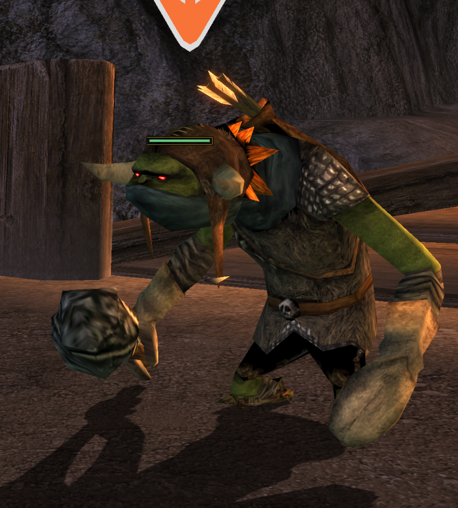
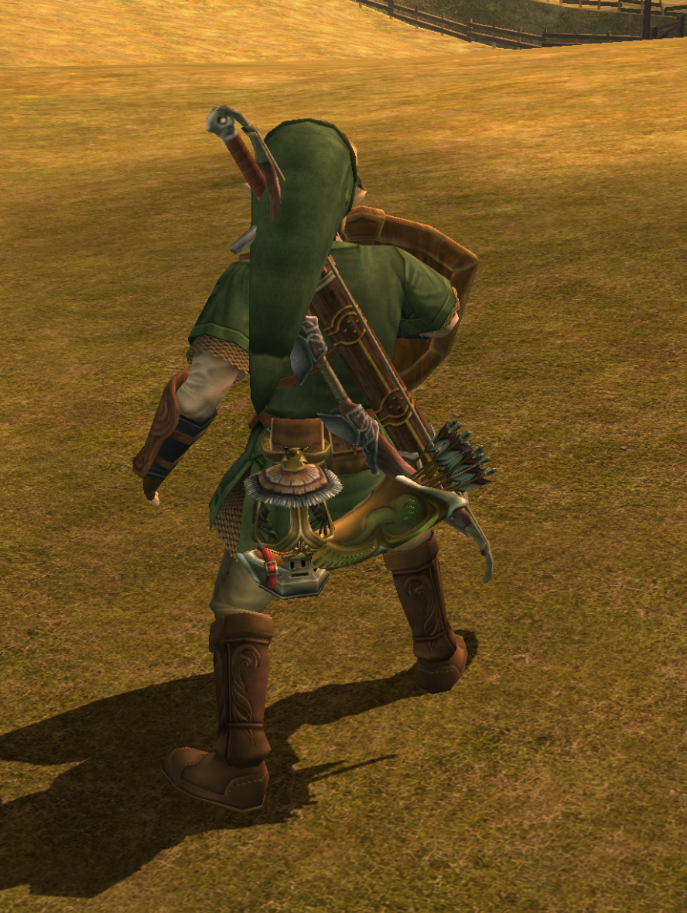
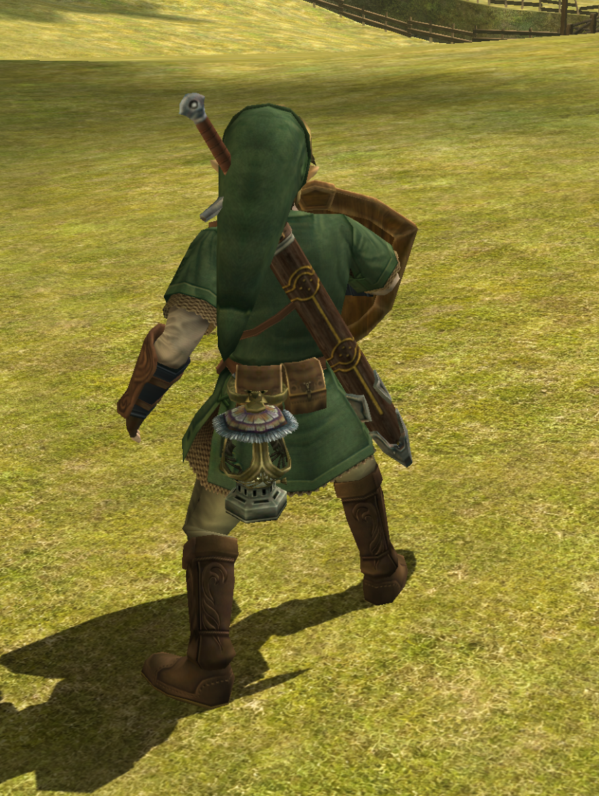
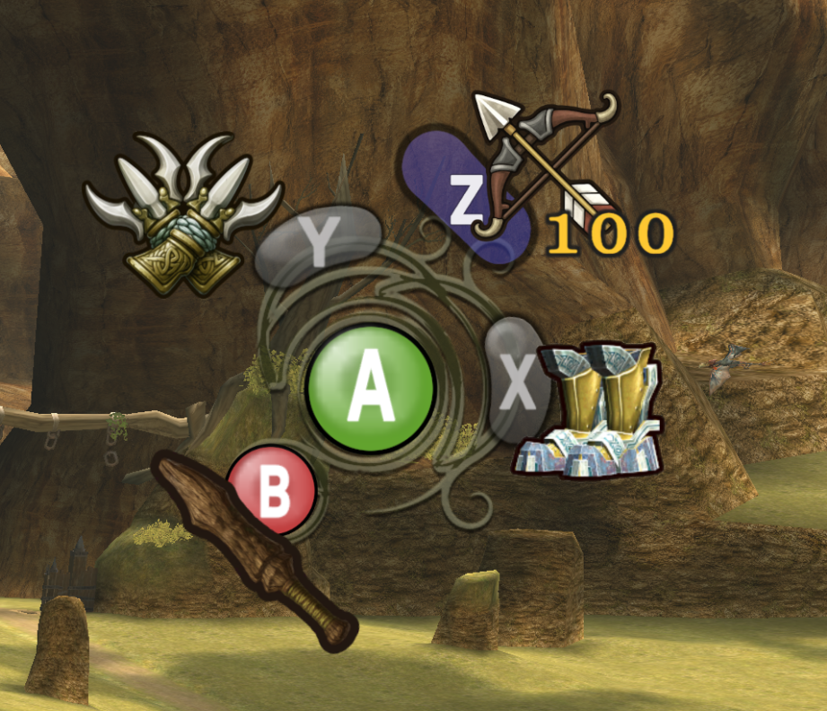
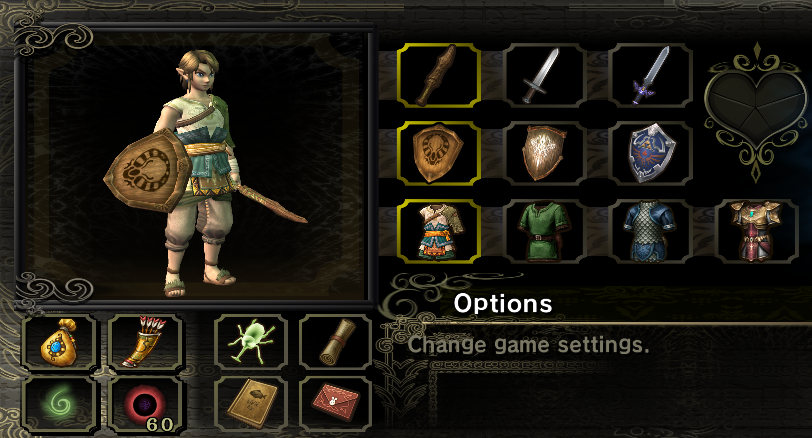
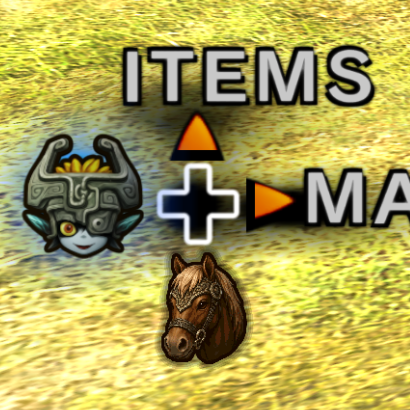

# Twilit Essentials (v1.1.9)

A collection of quality-of-life improvements, combat tweaks, and visual enhancements for *The Legend of Zelda: Twilight Princess* on the [Dusklight](https://github.com/TwilitRealm/dusklight) engine.

## Features

### Enemy Health Bars & Damage Numbers
* Renders health bars above active enemies in 3D space with line-of-sight checks and distance fading.
* Displays animated floating damage numbers when hitting enemies.
* Ghost and invisible enemies (such as Poes and Ghoul Rats) only display health bars while Link is using Wolf Senses.
* Optional setting to show numeric HP (`Current/Max`) using the in-game font.

  

### Visible Equipment
* Renders the Bow, Quiver (updates with 30/60/100 capacity upgrades), Lantern, and Horse Call on Link's model.
* Option to show gear only when assigned to X/Y/Z or permanently once unlocked.
* Individual toggles and mirror options for equipment placement.

  
  

### Custom Z Button & D-Pad Midna Call
* Allows assigning inventory items to the Z button, including ammo and lantern oil counters.
* Moves Midna's call to D-Pad Left.

  

### Collection Menu Enhancements
* Adds extra equipment slots for the Wooden Sword and Ordon Clothes in the Collection screen.
* Option to unequip swords and shields by selecting them again.

  

### D-Pad Down Horse Call
* Call Epona with D-Pad Down with a custom HUD icon.
* Can be configured to require the Horse Call item or work anytime.

  

### Sheathed Spin Attack
* Perform spin attacks directly with a sheathed sword.

### Puppet Zelda Fixed Pattern
* Removes RNG from Puppet Zelda's attacks with a consistent 7-step pattern.
* Option to always force the shortest attack (Sword Dive).

### Auto-Updater
* Checks GitHub for new releases and allows updating directly in-game.

### Mod Settings
All features can be configured individually in real-time through the Dusklight Mod Manager menu.

## Installation

1. Download `dusklight_twilit_essentials.dusk` from [Releases](https://github.com/F1mmel/dusklight-twilit-essentials/releases).
2. Place the file in your Dusklight mods folder:
   * **Windows:** `%APPDATA%\TwilitRealm\Dusklight\mods`
   * **Linux:** `~/.local/share/TwilitRealm/Dusklight/mods`
   * **macOS:** `~/Library/Application Support/TwilitRealm/Dusklight/mods`
3. Enable the mod in the in-game Mod Manager menu.

